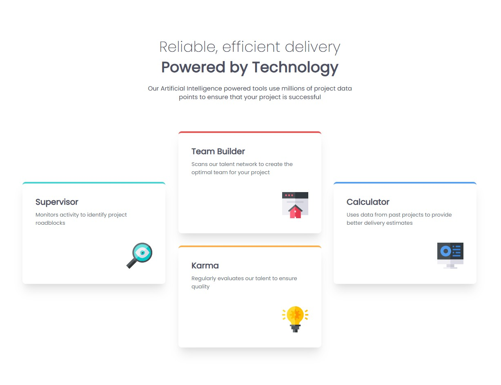

# Frontend Mentor - Four card feature solution

## Overview

This challenge was to build and deploy Frontend Mentor's Four card feature challenge.  Frontend Mentor provided various assets including the images, figma file, and style guide.

[Frontend Mentor Four card feature challenge](https://www.frontendmentor.io/challenges/four-card-feature-section-weK1eFYK)

This challenge required knowledge of css, semantic HTML, and building a responsive website.

### Screenshot

### Links

- Solution URL: [github repository](https://github.com/ClassPython/fem-four-card-feature)
- Live Site URL: [github-pages](https://classpython.github.io/fem-four-card-feature/)

### Built with

- Semantic HTML5 markup
- CSS Grid
- Mobile responsive design

### What I learned

 - The biggest challenge was re-arranging the order of the four content boxes when one goes from desktop to mobile.  For example the Team Builder box is at the top on desktop, while Supervisor becomes the top box on mobile.

 - Utilized CSS Grid and media queries to create a responsive layout that repositions content as the screen size changes.
 

